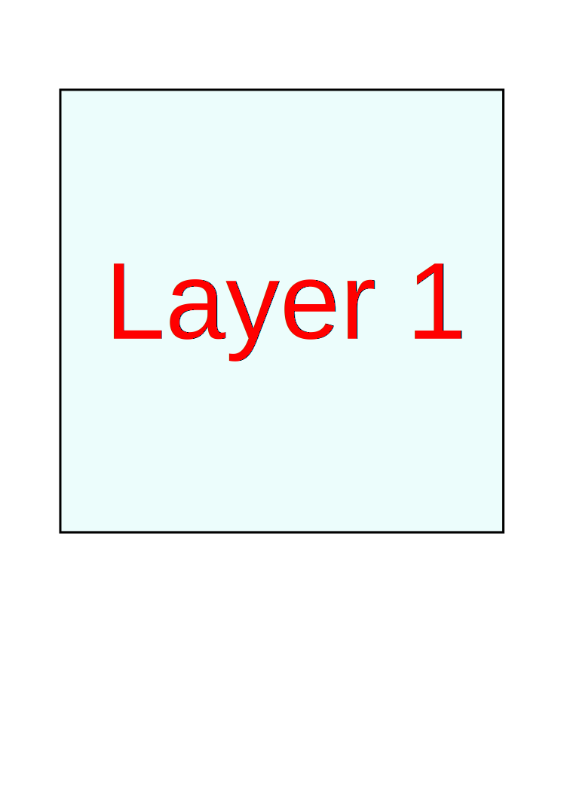
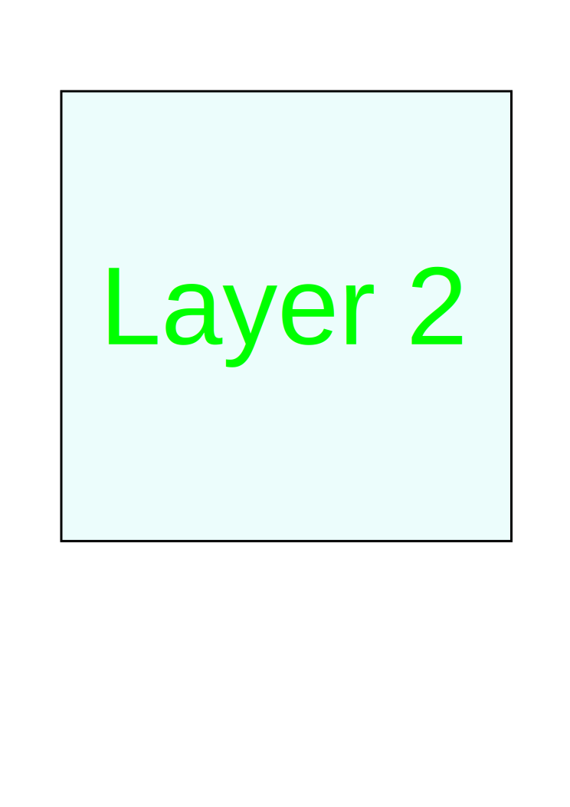

# impress.md.js    <!-- class: "slide", id: "title" -->

This is a test.

## Page 2    <!-- class: "slide" -->

This is a test too.

## Overview and Details    <!-- id: "overview-and-details", group: "zoom-test", class: "slide zoom-overview", dx: 0 -->

This is an overview.

## Detail 1    <!-- group: "zoom-test zoom-test-child", class: "slide zoom-item", scale: 0.25, tx: -280 -->

* foo
* bar
  * bar1
  * bar 2

## Detail 2    <!-- group: "zoom-test zoom-test-child", class: "slide zoom-item", scale: 0.25 -->

## Detail 3    <!-- group: "zoom-test zoom-test-child", class: "slide zoom-item", scale: 0.25, tx:  280 -->

* foo
* bar
  * bar1
  * bar 2

##     <!-- group: "zoom-test", class: "zoom-overview", dx: 1500 -->

## 3D Structure    <!-- id: "3d-structure", class: "slide layers-3d", dx: 0 -->

##     <!-- group: "layers-test", class: "layers-3d", z: 100, rotate-x: -70, rotate-y: -45 -->

  
  
  

##     <!-- group: "layers-test", id: "layers-detail" -->
